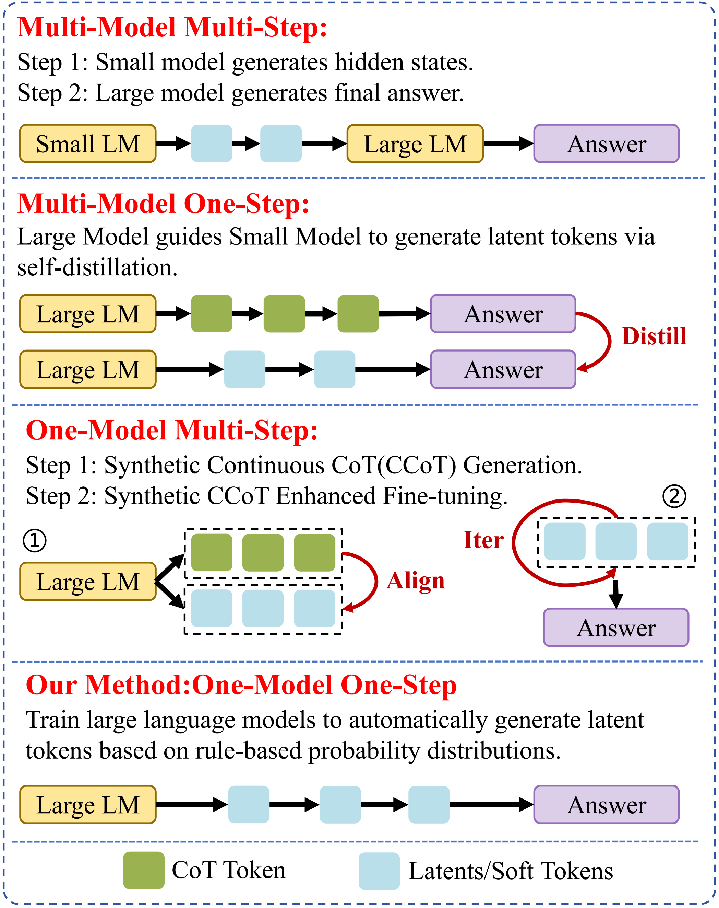
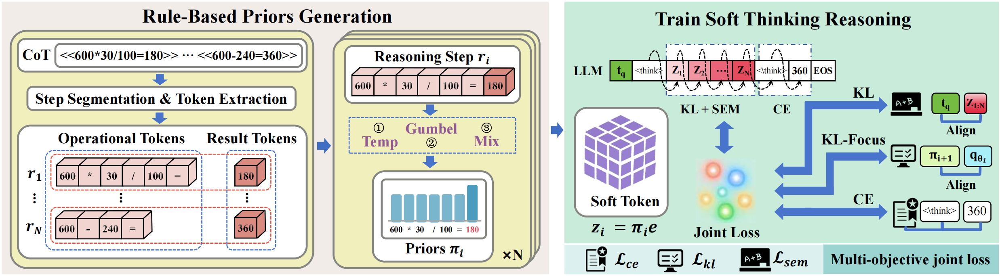
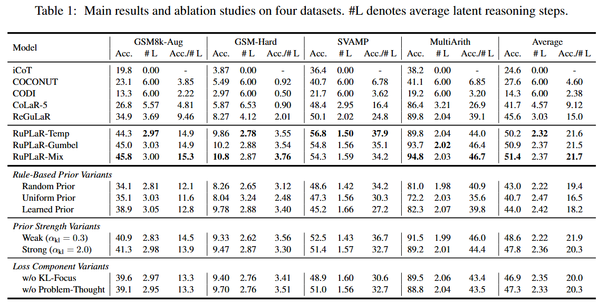
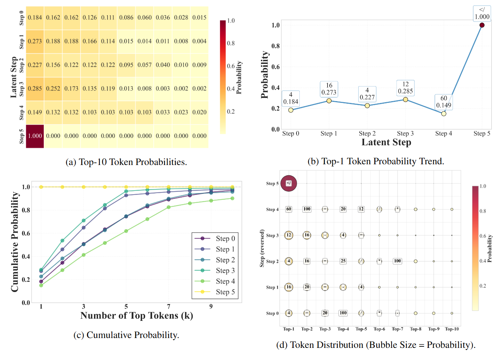
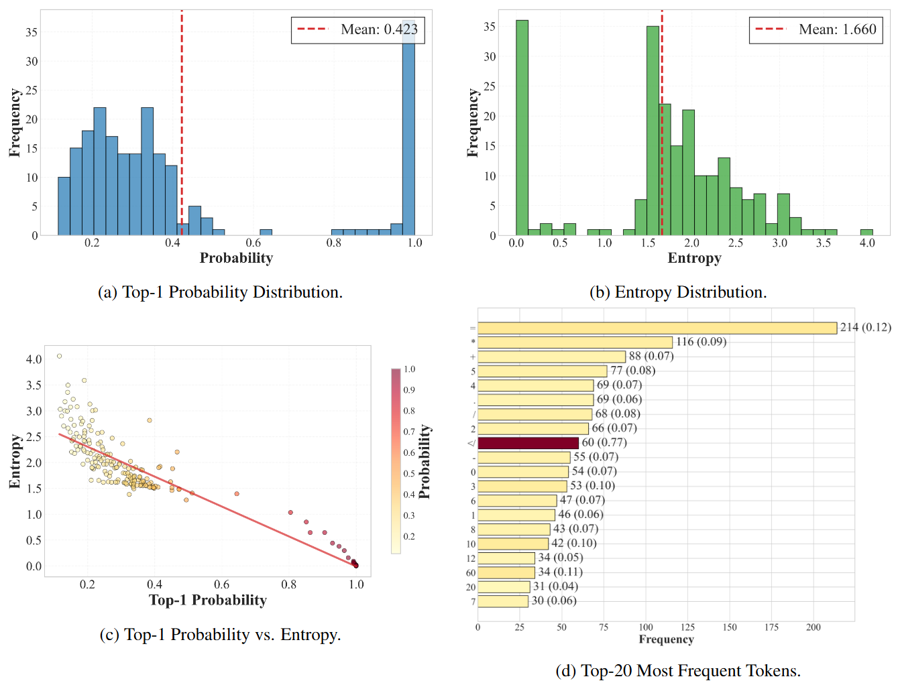

# RuPLaR : Efficient Latent Compression of LLM Reasoning Chains with Rule-Based Priors From Multi-Step to One-Step
This is the official code repository for the RuPLaR paper. We provide the source code, which is very easy to hack into, for your convenience.


## Abstract
The Chain-of-Thought (CoT) paradigm, while enhancing the interpretability of Large Language Models (LLMs), is constrained by the inefficiencies and expressive limits of natural language. Latent Chain-of-Thought (latent CoT) reasoning, which operates in a continuous latent space, offers a promising alternative but faces challenges from structural complexities in existing multi-step or multi-model paradigms, such as error propagation and coordination overhead. In this paper, we  introduce \textbf{One-Model One-Step}, a novel compression framework for \textbf{La}tent \textbf{R}easoning with \textbf{Ru}le-Based \textbf{P}riors(\textbf{RuPLaR}) to address this challenge. Our method trains an LLM to autonomously generate latent reasoning tokens in a single forward pass, guided by rule-based prior probability distributions, thereby eliminating cascaded processes and inter-model dependencies. To ensure reasoning quality, we design a multi-objective loss function that enforces answer consistency via cross-entropy, aligns soft tokens with a rule-based prior via KL-divergence (the Soft Thinking constraint), and problem-thought semantic alignment constraint that operates in the representation space. Extensive experiments show that our compression framework not only improves accuracy by 10.9\% over existing latent CoT methods but also achieves this with minimal token usage, underscoring its effectiveness and extensibility.

## Method


## Usage

### Dependent Libraries
```
pip install -r requirements.txt
```

### Training Model

The training script to be executed for this part is:
```
cd script
./run_distill_stage2_soft_embedding.sh
```

### Model Evaluation
We provide evaluations on four mathematical reasoning datasets — **GSM8k-aug**, **GSM-Hard**, **SVAMP** and **MultiArith** — using **Transformers** implementation frameworks.
```
python eval_soft_embedding_latent_model_hf.py --dataset [GSM8k-aug,GSM8k-hard,SVAMP,MultiArith]
```

### Best Model Weights
The trained model weights are available at the following links:
- [*llama3.2-instruct-1B-RuPLaR(Temp)*](https://huggingface.co/)
- [*llama3.2-instruct-1B-RuPLaR(Gumbel)*](https://huggingface.co/)
- [*llama3.2-instruct-1B-RuPLaR(Mix)*](https://huggingface.co/)

## Result

### Main Result

### Visualization

### Batch Analysis


## Acknowledgments
We extend our sincere gratitude to [*CoLaR*](https://github.com/xiaomi-research/colar) and [*LatentSFT*](https://github.com/DJC-GO-SOLO/Latent-SFT) for their great work and codebase, which served as the foundation for developing RuPLaR.

## Citation
If you find RuPLaR useful in your research, please consider citing it. 
```
@article{Luo2026RuPLaR,
  title={RuPLaR : Efficient Latent Compression of LLM Reasoning Chains with Rule-Based Priors From Multi-Step to One-Step},
  author={Xiaocheng, Luo and Kang,  Wang and Zaifu, Zhan and Yuechi, Zhou and Xiangyu, Duan},
  journal={arXiv preprint arXiv:2601.23184},
  year={2026}
}
```

